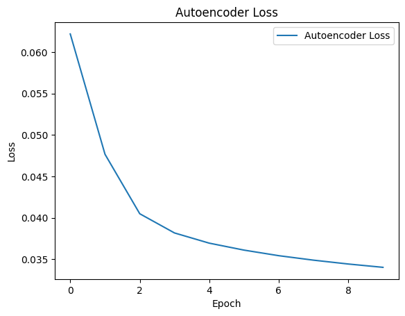
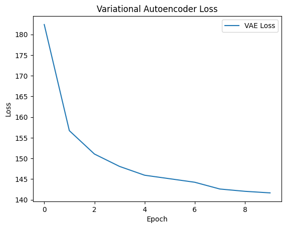
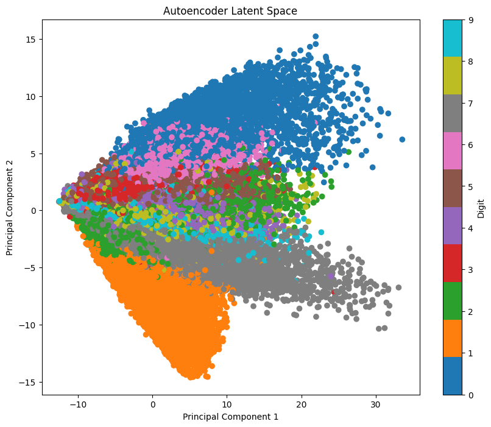
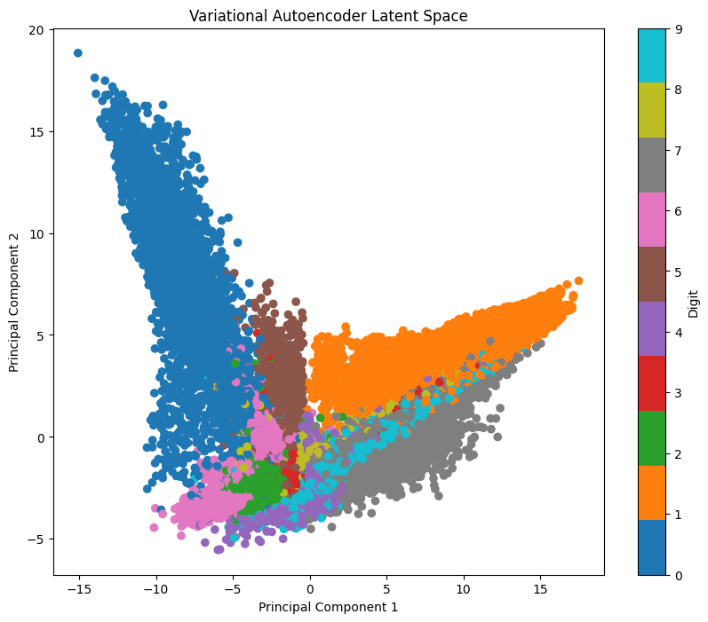
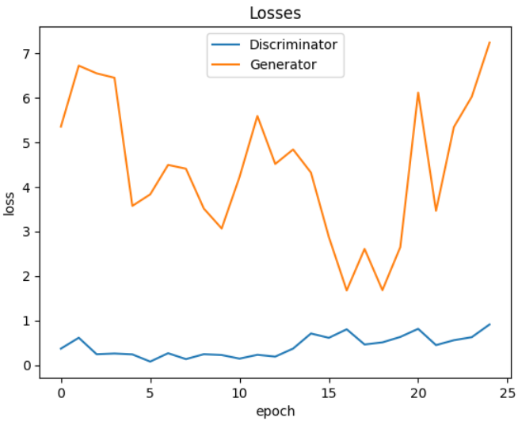
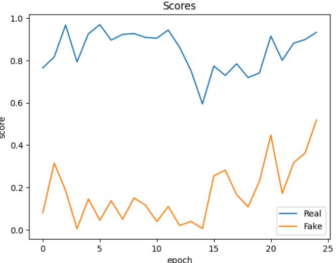
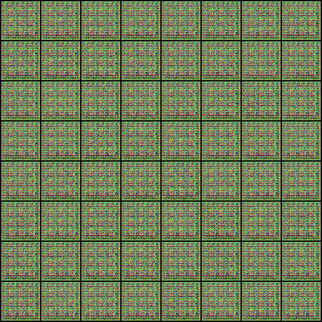
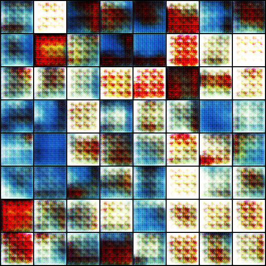

# AE vs VAE and GANs

## Part 1: AE vs VAE

### Objective:
The objective of this part is to compare Autoencoder (AE) and Variational Autoencoder (VAE) models trained on the MNIST dataset.

1. Establish an auto-encoder Architecture then train your model on MINST Dataset (Specify the best hyper-parameters).
2. Establish a Variational auto-encoder Architecture then train your model on MINST Dataset (Specify the best hyper-parameters).
3. Evaluate the two models by plotting (Loss, KL divergence, etc), what you conclude.
4. Try to plot the latent space of the two models.

### Results:

#### Autoencoder Loss:

#### Variational Autoencoder Loss and KL Divergence:

#### Latent Spaces:
- Autoencoder: 
- Variational Autoencoder: 

### Conclusion:
The plots demonstrate the training progress and performance of the Autoencoder and Variational Autoencoder models on the MNIST dataset.

## Part 2: GANs

### Objective:
The objective of this part is to train a Generative Adversarial Network (GAN) model on the Abstract Art Gallery dataset.

1. Using Pytorch Library Define Generator, Define Discriminator, Define Loss Function, Initialize Generator and Discriminator, GPU Setting, Configure Data Loader, Define Optimizers and do Training.
2. Evaluate the model by plotting (Loss, KL divergence, etc) (Generator and Discriminator), what you conclude.
3. Generate the new Data and compare their quality to the original ones.

### Results:

#### Losses of Generator and Discriminator:

#### Real vs. Fake Scores:

#### Example Generated Images:
- Generated Image 1: 
- Generated Image 20: 

### Conclusion:
The training of the GAN resulted in fluctuating losses over 25 epochs, indicating some instability in the process. However, the discriminator effectively distinguished between real and fake images throughout. Further optimization may be needed to improve stability and image quality.

## What I learned from the lab?

Through this lab, I gained practical experience in implementing and training various deep learning models, including Autoencoders (AE), Variational Autoencoders (VAE), and Generative Adversarial Networks (GANs). I learned how to optimize model performance by tuning hyperparameters and interpreting training metrics such as loss and KL divergence.